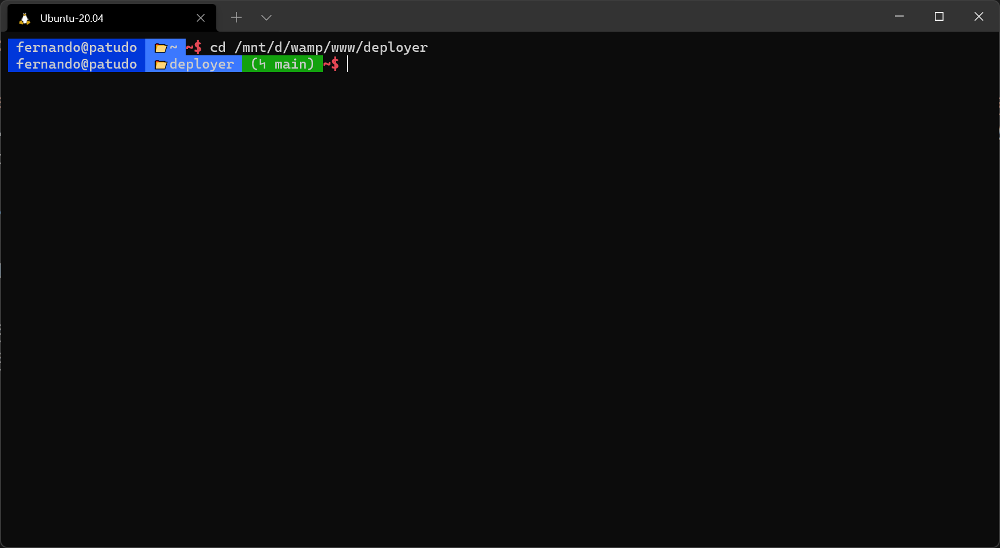
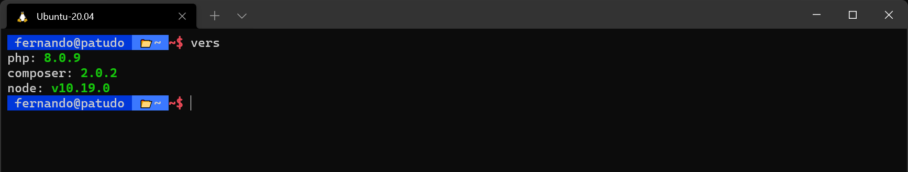

# dotfiles

This repository contains my personal dotfiles. Additionally I also added some config files for tools that I use, so I can restore everything after the zombie apocalipse has ended.

## Windows

> [!TIP]
> Ensure that execution policy is right before running anything:
> ```ps1
> Set-ExecutionPolicy -Scope Process -ExecutionPolicy Bypass
> ```

Run the following to setup everything on windows terminal:

```ps1
iex ((iwr "https://raw.githubusercontent.com/Dovyski/dotfiles/main/windows.ps1").Content)
```

## Linux

Run:

```bash
bash -c "$(curl -fsSL https://raw.githubusercontent.com/Dovyski/dotfiles/main/ubuntu.sh)"
```

### `.bash_profile`

My [.bash_profile](.bash_profile) is a distillation of several files I've came across, plus a few utilities for web development. This is the overall look:



The additional utilities are small commands like `vers`, which shows the current version of some things I'm interested on:



## `espanso.yml`

The [espanso.yml](espanso.yml) file is my default configuration for the [espanso](https://espanso.org) tool. If you are not using it, I highly recommend it. It saves a lot of typying for things you do quite often.

## References

The files I use are based on the following sources:

- https://tldp.org/LDP/abs/html/sample-bashrc.html
- https://misc.flogisoft.com/bash/tip_colors_and_formatting
